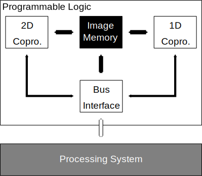

Overview of Kinpira
==================================================

Kinpira is the hardware accelerator, or platform for neural networks.
This project aims for the flexibility and the performance
for various network structures.

Directory Structure
----------------------------------------

This project contains several subdirectories for each independent parts.
The contents of each directory is summarized as below:

* data
  - Contains various type of data.
  - Target data is not commited on the repository on default,
    use generation codes for data generation.
* doc
  - Contains documentations for the project.
* rtl
  - Contains main rtl modules for the hardware accelerator.
  - Mainly written by SystemVerilog 2012
  - Divided into several subproject by the major functionality.
    + gobou
    + renkon
    + ninjin
    + common
* sim
  - Contains simulation sources for emulating rtl modules.
  - Mainly written by C++ 14
* syn
  - Contains scripts for synthesizing the design using Design Compiler.
  - TODO: Performance could be evaluated using tcl scripts for PrimeTime.
* (icc)
  - TODO: Contains scripts for routing and placing netlists from the design
    using IC Compiler.
* tests
  - Contains testbench modules for each module in ``rtl``.
  - Mainly written by SystemVerilog 2012
* utils
  - Contains auxiliary scripts for design assistance
    + Random test-pattern generation script
    + tree-based module generation support script
    + TODO: weight serializer from DL frameworks
* vivado
  - Contains general scripts for synthesizing and implementing the design
    using Vivado.
* zedboard
  - Contains the implemented design or/and tcl scripts
    for Avnet ZedBoard using Vivado.
  - Not commited on the repository currently.

Overall architecture
----------------------------------------

Kinpira's overall architecture is summarized in Figure :ref:`kinpira` .

.. _kinpira::

